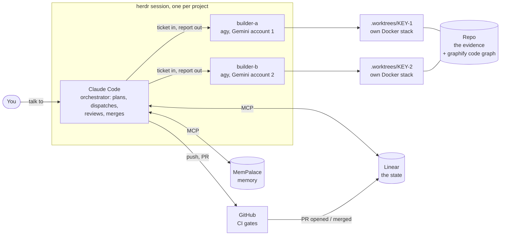
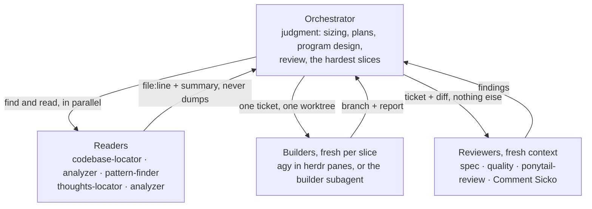
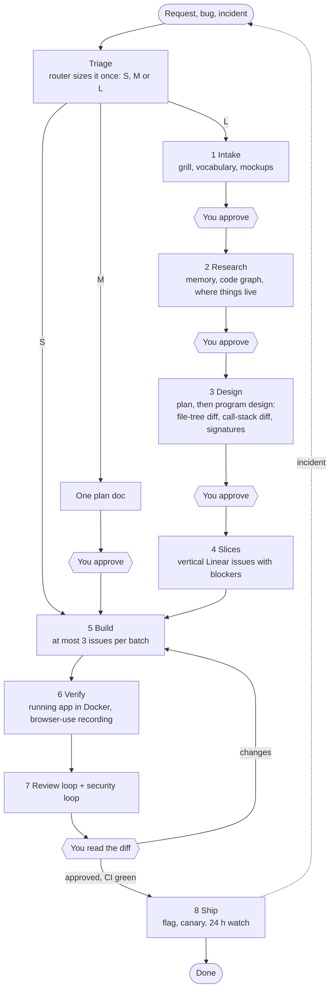
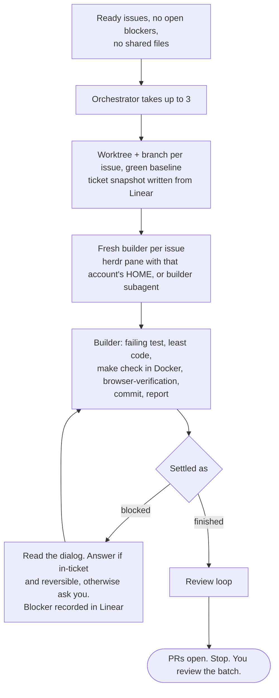
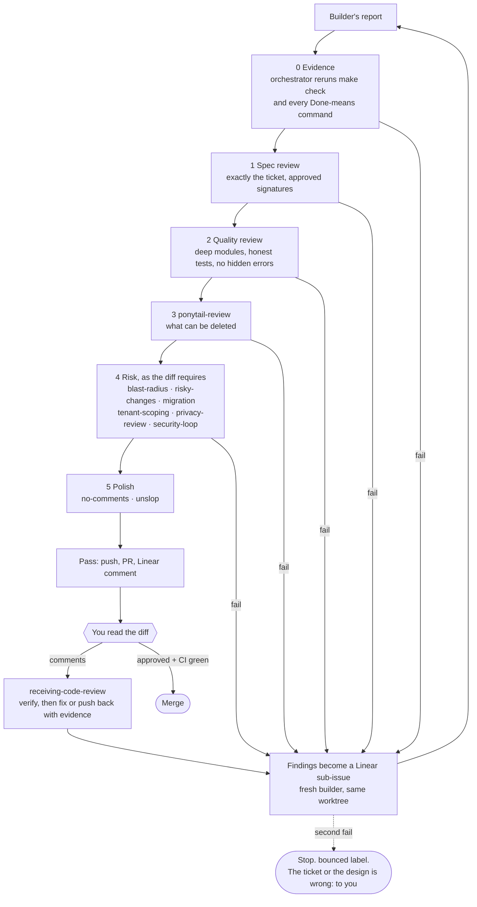
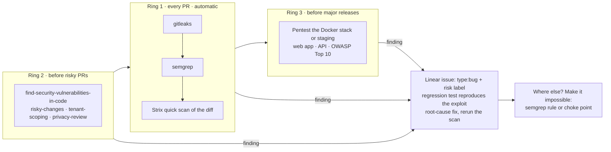
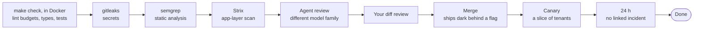
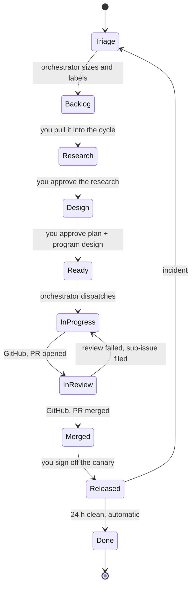

# Software factory

A template. Point it at a folder and that folder becomes a project where every agent already knows how work gets done: which skill runs at which step, how subagents and worktrees are used, how review and security loops run, what must happen in Docker, and how everything is tracked in Linear.

```bash
./install.sh ~/code/new-saas        # new software: folder is created and git-initialised
./install.sh ~/code/existing-repo   # existing repo: the factory is added, nothing of yours is overwritten
```

Everything it installs is committed to the project. **A teammate who clones the project gets the same skills, rules, hooks, subagents and MCP servers you have**, and runs `scripts/factory-doctor.sh` to see which tools their machine still needs.

The idea in one paragraph: work is sliced vertically and planned by Claude Code, approved by you at research, plan and program design, built by fresh builders in isolated worktrees with tests first and the least code that works (ponytail, always on), run only inside Docker, verified against the running app with browser-use, scanned on every PR, reviewed by a different model family than the one that wrote it and then by you, merged only through green CI, released behind a flag, and watched for a day. Every station leaves an artifact in the repo. Linear holds the state: every issue, to-do, blocker, review and decision.

It is deliberately **not** a lights-off factory. Models are rewarded for passing tests, not for good design, and more AI reviewers raise the floor without moving the ceiling. Your time goes where a wrong line costs the most: research, plans and program design. Expect 2–3× a solo developer with quality intact.

## The stack



Three quotas, used for what each is best at: Claude Code for judgment, the Gemini subscriptions for volume. Builders never see Linear and never push. No agy or herdr on a machine? The orchestrator builds with its own `builder` subagent instead; nothing else changes.

## Who does the work

Subagents exist to protect context, not to play roles.



For a simple stack with a clean API seam, one slice may be split into a backend issue and a frontend issue that share the approved signatures and run in parallel, plus a third issue, blocked by both, that verifies the slice end to end. Never split further into layers.

## The pipeline



Any `risk:` label (billing, auth, data, infra, privacy) forces at least M and a human review. A new project's first issue is always "boots in Docker".

## The build loop



## The review loop



Every reviewer is a fresh subagent that never saw the code being written. Every round leaves a Linear comment.

## The security loop



Never production, never anything you do not own. A leaked secret is rotated first, and rewriting history is yours to do, not an agent's.

## The gate ladder

Nothing skips a rung. The first four are automatic and block the PR; agents cannot merge around a required check.



## An issue's life in Linear



## The loops

| Loop | Period | What turns it |
|---|---|---|
| Red, green | minutes | Builder: failing test, code, pass (`test-driven-development`) |
| Rework | per slice | Failed review becomes a sub-issue and a fresh builder. Two fails stop the line (`review-loop`) |
| Batch | a few hours | Up to 3 issues out, PRs back, you review, next batch (`dispatch-builders`) |
| Security | per PR and per release | Three rings; findings become issues and then rules (`security-loop`) |
| Context | per session | At about 60% context: `/create_handoff`, fresh session, `/resume_handoff`. The same file hands work to a teammate |
| Feedback | continuous | Sentry and client reports land in Triage and travel the same path as features |
| Learning | per cycle | `bounced` issues, `ponytail-audit`, `ponytail-debt` and `reflect` become skill edits, lint rules, ADRs and `type:debt` issues |

## The rules every agent gets

From `template/AGENTS.md`, loaded into every agent in every session:

1. **Ponytail is always on**, level `full`, for every line of code, without being asked.
2. **Project code runs in Docker, never on the host.** Agents run whatever the code they just wrote says; a container is where that is allowed to go wrong. It also makes your machine, a teammate's, a builder's worktree and CI identical.
3. **One browser tool: browser-use.** No Playwright, Puppeteer, Cypress or Selenium.
4. Shared vocabulary (`CONTEXT.md`). 5. Test first, test behavior. 6. Fix root causes. 7. Prove it works. 8. Query the code graph before grepping. 9. Stop when reality disagrees with the plan. 10. Irreversible actions belong to the human.

Every skill and tool is described in [`template/docs/agents/skills.md`](template/docs/agents/skills.md): what it does, who runs it, when, and what was deliberately left out.

## Setting up

Once per machine: [`template/docs/agents/machine-setup.md`](template/docs/agents/machine-setup.md) (it ships into every project, for teammates). Once per Linear team: [`docs/linear.md`](docs/linear.md). Then `./install.sh <project>`, which:

- copies `template/`, never overwriting a file you already have;
- fetches everything in [`skills.tsv`](skills.tsv) at pinned commits: 55 skills, 7 commands, 6 subagents, the ponytail rules file and one script;
- patches them for this stack, links `.claude/skills` to `.agents/skills` so every agent shares one folder;
- runs the command guard's self-test and the machine doctor. About 20 seconds; re-run any time.

Then, in the project:

1. Fill in `CONTEXT.md` and the Linear team key in `docs/agents/issue-tracker.md`.
2. First issue, before any feature: **boots in Docker** (`Dockerfile`, `compose.yaml`, `CHECK` and `PORT` in the `Makefile`).
3. Open Claude Code, approve the `linear` and `mempalace` MCP servers, run `/setup-matt-pocock-skills` (keep the Linear tracker doc that is already there).
4. `graphify .` for the code graph. Once the app boots, `/create-verification-skill`.
5. On GitHub: protect `main`, require the four `gates` checks, install Renovate, add `STRIX_LLM` and `LLM_API_KEY`.
6. Read the diff. Commit.

## A session

```bash
cd ~/code/my-saas && herdr     # then, in the first pane:
claude
```

You only ever talk to Claude Code.

| You type | What happens |
|---|---|
| "Triage the Linear inbox." | Sizes and labels each item, closes duplicates, asks what it cannot answer. |
| "Run research for CRM-40." | Searches memory and the code graph, fans out readers, writes `thoughts/research/…`. You approve in a Linear comment. |
| "Create the plan and program design for CRM-40." | You read the plan, the call-stack diff and the signatures. Approve or send back. |
| "Slice it." | `to-tickets` creates child issues with blockers. Unblocked ones move to Ready. |
| "Write one plan for CRM-41." / "Build CRM-42 directly." | The M and S paths. |
| "Take the top 3 Ready issues." | The build loop, then the review loop. Ends with PRs waiting for you. |
| *(you work the In Review column)* | Read each diff. Approve or comment. CI is already green or it would not be here. |
| "Merge approved PRs." | Code lands dark. You flip the canary flag; 24 clean hours later the issue is Done. |
| "Write a handoff." | Detach with `ctrl+b q`. Builders keep running. |

At the end of each cycle: "Show me the `bounced` issues and why, then run `ponytail-audit` and `ponytail-debt`." Turn each recurring reason into a skill edit with `writing-for-agents`. `graphify update .`, prune worktrees, archive old handoffs.

## What is in the box

```
install.sh              applies the factory to a new or existing project
skills.tsv              third-party skills: repo, pinned commit, source path, destination
docs/linear.md          one-time Linear team setup
template/               what lands in every project
  AGENTS.md             the ten rules + the builder contract            (every agent reads this)
  CLAUDE.md             router, stations, who does the work, Linear rules, ticket template
  CONTEXT.md            the project's vocabulary
  Makefile              up · check · url · shell · logs · down, all through docker compose
  .mcp.json             Linear and MemPalace, shared with every teammate
  docs/agents/          skills.md (the catalog) · issue-tracker.md (Linear) · machine-setup.md
  scripts/factory-doctor.sh      is this machine ready?
  .agents/hooks/        command guard: blocks rm -rf /, force-push, terraform destroy, token reads…
  .agents/skills/       ten factory skills: dispatch-builders, review-loop, security-loop,
                        program-design, docker-dev, browser-verification,
                        migration, tenant-scoping, privacy-review, infra-change
  .claude/agents/builder.md      the fallback builder subagent
  .claude/settings.json          registers the guard
  .github/workflows/gates.yml    gitleaks, semgrep, make check, Strix
  renovate.json
```

Third-party skills come from [superpowers](https://github.com/obra/superpowers), [mattpocock/skills](https://github.com/mattpocock/skills), [pstack](https://github.com/cursor/plugins/tree/main/pstack), [ponytail](https://github.com/DietrichGebert/ponytail), [davidondrej/skills](https://github.com/davidondrej/skills) (all MIT), [humanlayer](https://github.com/humanlayer/humanlayer), [herdr](https://github.com/herdrdev/herdr), [strix](https://github.com/usestrix/strix) (Apache-2.0) and [michaelshimeles/skills](https://github.com/michaelshimeles/skills) (no licence file: fine to use, ask before redistributing). The method behind the pipeline is HumanLayer's [advanced context engineering](https://github.com/humanlayer/advanced-context-engineering-for-coding-agents) essays. Tools: [graphify](https://github.com/Graphify-Labs/graphify), [MemPalace](https://github.com/mempalace/mempalace), [Mem0](https://github.com/mem0ai/mem0) (only if the product needs user memory), browser-use.

**Updating a source:** read the upstream diff first (a skill runs with your agent's permissions), replace its commit in `skills.tsv`, re-run `install.sh` on the project.

## Build order

Do not stand all of this up before the first project.

1. **Weeks 1–2, the core.** Docker boot, router, grill, research, plan, program design, tickets, worktrees, TDD, verify, review loop.
2. **Weeks 3–4, the automatic gates.** Lint budgets in `CHECK`, Strix, semgrep, gitleaks, preview environments.
3. **Weeks 5–6, operations.** OpenTelemetry, Sentry, one SLO per critical flow, runbooks, a rollback drill you actually perform.
4. **Ongoing.** Sharpen the factory skills after you have felt each pain once.

Not in the box because they depend on your stack: `Dockerfile` and `compose.yaml`, lint budget config, feature flags, preview environments, IaC, observability.

## Verified, and not

Verified on 2026-09-18: every path in `skills.tsv` exists at its pinned commit; every skill that calls another skill or subagent has it installed; the installer runs end to end on a new folder and on an existing repo and is idempotent; the guard passes its 38 cases; herdr syntax in `dispatch-builders` matches herdr 0.9 source; the `Makefile` was run against real containers, with two worktree-named folders (`.worktrees/CRM-14`, `CRM-15`) up at once: separate stacks, separate ports, clean teardown.

Not verified, check once by hand ([machine setup](template/docs/agents/machine-setup.md#check-once-by-hand)): that agy picks up `.agents/skills/`, that `--env HOME=…` isolates the Google accounts, that herdr detects agy's settled states, browser-use recording on your desktop session, and the CI workflow on a real PR. The guard covers Claude Code only. agy has a `hooks.json`, but its deny protocol is undocumented, so builders rely on agy's own permission prompts, the worktree, Docker, and having no production secrets in their environment.
